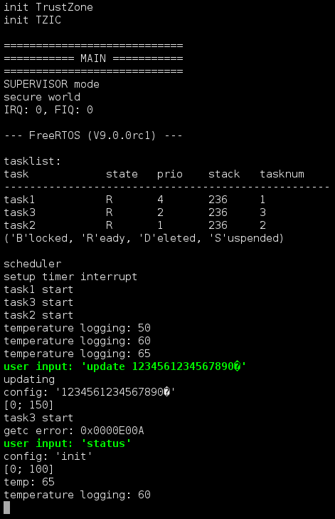

# Self-healing FreeRTOS

```
@author:       Michael Denzel
@email:        research@michael-denzel.de
@license:      GNU General Public License 2.0 or later
@date:         2017-03-17
@version:      0.1
```

A **_proof-of-concept implementation_** of an ARM TrustZone port of FreeRTOS
V9.0.0rc1 which can automatically self-heal from certain attacks and runs on top
of ARM TrustZone.

Source code includes code from:
- FreeRTOS V9.0.0rc1 -- www.freertos.org
- Dongli Zhang -- https://github.com/finallyjustice/imx53qsb-code "trustzone-smc"
- James Walmsley -- https://github.com/jameswalmsley/RaspberryPi-FreeRTOS
- Francesco Balducci -- https://balau82.wordpress.com/2010/12/16/using-newlib-in-arm-bare-metal-program


## Quickstart

1;2802;0cJust compile the tool using:

```
$ make
$ ./setupsd.sh /dev/sdX
```

`/dev/sdX` is the path to the SD-card which should be flashed with the image.

**Test system: Freescale i.MX53 Quick Start Board _ARM Cortex-A8_**

Required tools:
- arm-none-eabi-gcc (worked with version 5.2.0, arm-none-eabi-as/-ld 2.27)
- arm-none-eabi-binutils
- arm-none-eabi-newlib
- uboot-utils (for mkimage, worked with version 2016.05)
- (minicom or similar)

To connect to the board:
```
$ minicom -s -c on

goto Serial port setup and set the following:
Serial Device:          /dev/ttyUSB0 (or where mounted)
Callin Program:         (empty)
Callout Program:        (empty)
Bps/Par/Bits:           115200 8N1
Hardware Flow Control:  No (important!)
Software Flow Control:  No

(start)
```


## Makefile Options

There are a couple of Makefile options:

#### Cleanup
Use `make clean` to clean the compiled files.

#### Logging and Printing
- `make info` - print some logging information
- `make smc` - print also the secure monitor calls (includes `info`)
- `make debug` - very verbose logging level (includes `info` and `smc`)

#### Timing analysis
- `make timingTz` - will compile a special image used for timing TrustZone
- `make timingNoTz` - will compile a special image used for timing the system without TrustZone

#### TrustZone
Normally the operating system will always be compiled for TrustZone. If that is
not desired, there is the option to compile using `make noTz`, even though we
recommend to compile with TrustZone.


## Attack and Self-healing

**Remark: by default the buffer overflow was turned off. To turn it on, one has
  to supply the compilation flag `BUFFEROVERFLOW`. See also file
  `./Demo/Drivers/IO.c`. Note that there is no Makefile option to supply this
  flag directly to prevent accidentally compiling a vulnerable image.**

#### Background

To test the self-healing capabilities of our adjusted FreeRTOS operating system,
we simulated a simple temperature sensor and included a buffer overflow using
the vulnerable C function `strcpy` (see `./Demo/Drivers/IO.c`).

The function `set_config_temperature` can update the struct of the temperature
sensor with a new "info" string. However, the buffer is only 16 bytes long and
can be overflowed. This enables an attacker to change the `max` and `min`
temperature fields (and of course various other memory attacks).

Our self-healing capability (see `./Demo/TrustZone/selfhealing.c::detection()`)
checks that the `max` temperature is below 100 degrees for task3.  **Note: this
is just a proof-of-concept implementation, a full implementation would have to
check also the `min` temperature, the variables of task1 and task2, that no
further tasks exists, and so on. But, this should be enough to demonstrate the
basic idea of self-healing**

#### Example Run

The following picture shows an example run of `./attack.sh` which overwrites the
`max` temperature with 150 degrees. User inputs are highlighted in green, these
are in this case the actual attack input.



Explanations:

After all three tasks are started, the attacker updates the "info" string to
1234561234567890 plus the binary number for 150. On can see three lines later
that FreeRTOS reports back the temperature as `[0; 150]`. Immediately
afterwards, self-healing takes place which can be seen at the reset task3 (it
says again "task3 start" because task3 was deleted and restarted). When the
attacker sends the next `status` command, the system already reset the
temperature to the initial value `[0; 100]` and "info" to the initial value
"init".

This implementation is not bulletproof of course. An adversary could still
attack the self-healing functionality directly or circumvent it another way.
However, since the self-healing functionality is part of the ARM TrustZone
secure world, this is considerably more effort.


## Known Issues

- bug in the interrupt system
